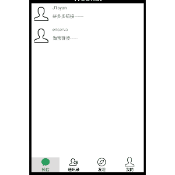

## Activity生命周期与跳转
<font color="red">效果显示:</font></br>
</a>

### Activity生命周期
使用log打印进行不同操作时actitiy生命周期调用的函数，以下结果基于老师课上代码。</br>
启动后
```java
这是生命周期MainActivity3:onCreate
这是生命周期MainActivity3:onStart
这是生命周期MainActivity3:onResume
```
切到后台
```java
这是生命周期MainActivity3:onPause
这是生命周期MainActivity3:onStop
```
再次唤醒
java
```
这是生命周期MainActivity3:onRestart
这是生命周期MainActivity3:onStart
这是生命周期MainActivity3:onResume
```

### 页面跳转

FindFragment.java</br>
目的:仿照微信发现界面</br>
分析:</br>
<li>initTitle() 方法，初始化数据，列表名
<li> initFindView()方法与FindAdapter.java 相连，将数据传入相应adapter中

```java
package com.example.mywechatdemo;

import android.content.Context;
import android.os.Bundle;

import androidx.fragment.app.Fragment;
import androidx.fragment.app.FragmentActivity;
import androidx.recyclerview.widget.LinearLayoutManager;
import androidx.recyclerview.widget.RecyclerView;

import android.view.LayoutInflater;
import android.view.View;
import android.view.ViewGroup;

import java.util.ArrayList;

public class FindFragment extends Fragment {
    private RecyclerView recyclerView;
    private ArrayList<String> title = new ArrayList<>();
    private FindAdapter FindAdapter;
    private Context context;


    @Override
    public View onCreateView(LayoutInflater inflater, ViewGroup container,
                             Bundle savedInstanceState) {
        // Inflate the layout for this fragment
        View view;
        view = inflater.inflate(R.layout.tab03, container, false);

        recyclerView =view.findViewById(R.id.recy03);

        initTitle();
        initFindView();

        return view;
    }
    public void initFindView(){
        context = this.getActivity();
        FindAdapter= new FindAdapter(context,title);
        //设置LayoutManager
        LinearLayoutManager linearLayoutManager = new LinearLayoutManager(context);
        linearLayoutManager.setOrientation(LinearLayoutManager.VERTICAL);
        recyclerView.setLayoutManager(linearLayoutManager);
        recyclerView.setHasFixedSize(true);
        recyclerView.setAdapter(FindAdapter);
    }
    public void initTitle(){
        title.add("朋友圈");
        title.add("视频号");
        title.add("直播");
        title.add("扫一扫");
        title.add("摇一摇");
        title.add("看一看");
        title.add("搜一搜");
        title.add("附近");
        title.add("购物");
        title.add("游戏");
        title.add("小程序");

    }
}
```

FindAdapter.java:</br>
目的: UI组件和数据之间的桥梁，它帮助我们将数据填充到UI组件当中</br>
分析:
```java
public void onBindViewHolder(@NonNull Myholder holder, int position) {
        holder.textView1.setText(title.get(position));
        holder.linearLayoutOfDiscover.setOnClickListener(new View.OnClickListener() {
            @Override
            public void onClick(View view) {
                Intent intent = new Intent(context,findActivity.class);
                context.startActivity(intent);
            }
        });
Intent  将页面跳转与点击列表事件相关联
```

```java
package com.example.mywechatdemo;

import android.content.Context;
import android.content.Intent;
import android.view.LayoutInflater;
import android.view.View;
import android.view.ViewGroup;
import android.widget.LinearLayout;
import android.widget.TextView;

import androidx.annotation.NonNull;
import androidx.recyclerview.widget.RecyclerView;

import java.util.ArrayList;

public class FindAdapter extends RecyclerView.Adapter<FindAdapter.Myholder> {
    private Context context;
    private ArrayList<String> title;

    public FindAdapter(Context context,ArrayList<String> newsTitle){
        this.context = context;
        this.title = newsTitle;
    }

    @NonNull
    @Override
    public Myholder onCreateViewHolder(@NonNull ViewGroup parent, int viewType) {
        View view = LayoutInflater.from(context).inflate(R.layout.item_find, parent, false);
        Myholder myholder;
        myholder = new Myholder(view);
        return myholder;
    }

    @Override
    public void onBindViewHolder(@NonNull Myholder holder, int position) {
        holder.textView1.setText(title.get(position));
        holder.linearLayoutOfDiscover.setOnClickListener(new View.OnClickListener() {
            @Override
            public void onClick(View view) {
                Intent intent = new Intent(context,findActivity.class);
                context.startActivity(intent);
            }
        });
    }

    @Override
    public int getItemCount() {
        return title.size();
    }

    public class Myholder extends RecyclerView.ViewHolder{
        private TextView textView1;
        private TextView textView2;
        LinearLayout linearLayoutOfDiscover;

        public Myholder(@NonNull View itemView) {
            super(itemView);
            textView1 = itemView.findViewById(R.id.textView1_find);

            linearLayoutOfDiscover = itemView.findViewById(R.id.linearlayout_find);
        }
    }
}
```

findActivity.java:
目的:点击跳转页面的显示</br>
分析:
```java
   public void onActivityResult(ActivityResult result) {
                    if (result.getResultCode() == 2) {
                        TextView textView_love = findViewById(R.id.approval);
                        textView_love.setText(result.getData().getStringExtra("result") + "赞同");
                    }
                }
传递findResultActivity.java对应的code=2的回显值 ,并用registerForActivityResult方法进行封装


    protected void onStart() {
        super.onStart();
        agreementButton = findViewById(R.id.approval);
        agreementButton.setOnClickListener(new View.OnClickListener() {
            @Override
            public void onClick(View view) {
                Intent intent = new Intent(findActivity.this, findResultActivity.class);
                test.launch(intent);//启动函数
            }
        });
    }
    从findActivity跳转至findResultActivity界面
```


```java
package com.example.mywechatdemo;

import androidx.activity.result.ActivityResult;
import androidx.activity.result.ActivityResultCallback;
import androidx.activity.result.ActivityResultLauncher;
import androidx.activity.result.contract.ActivityResultContracts;
import androidx.appcompat.app.AppCompatActivity;

import android.annotation.SuppressLint;
import android.content.Intent;
import android.os.Bundle;
import android.view.View;
import android.widget.Button;
import android.widget.ImageView;
import android.widget.TextView;

public class findActivity extends AppCompatActivity {
    private ImageView imageView;
    private Button agreementButton;


    @Override
    protected void onCreate(Bundle savedInstanceState) {
        super.onCreate(savedInstanceState);
        setContentView(R.layout.activity_find);
        imageView =findViewById(R.id.friend);
        imageView.setImageResource(R.drawable.txl);

    }

    @Override
    protected void onStart() {
        super.onStart();
        agreementButton = findViewById(R.id.approval);
        agreementButton.setOnClickListener(new View.OnClickListener() {
            @Override
            public void onClick(View view) {
                Intent intent = new Intent(findActivity.this, findResultActivity.class);
                test.launch(intent);//启动函数
            }
        });
    }
    public ActivityResultLauncher<Intent> test = registerForActivityResult(
            new ActivityResultContracts.StartActivityForResult(),
            new ActivityResultCallback<ActivityResult>() {

//                @SuppressLint("SetTextI18n")
                @Override
                public void onActivityResult(ActivityResult result) {
                    if (result.getResultCode() == 2) {
                        TextView textView_love = findViewById(R.id.approval);
                        textView_love.setText(result.getData().getStringExtra("result") + "赞同");
                    }
                }
            }
    );
}

findResultActivity.java</br>
目的:点击事件，将findResultActivity的值传到findActivity</br>
分析:setResult(2, intent),findActivity需要对应的result.getResultCode等于2，才会接接收

```java
package com.example.mywechatdemo;

import androidx.appcompat.app.AppCompatActivity;

import android.content.Intent;
import android.os.Bundle;

import java.util.Random;

public class findResultActivity extends AppCompatActivity {

    @Override
    protected void onCreate(Bundle savedInstanceState) {
        super.onCreate(savedInstanceState);
        setContentView(R.layout.activity_find_result);
        Intent intent = getIntent();
        Random r = new Random();
        int i = r.nextInt(200);
        intent.putExtra("result", String.valueOf(i));
        setResult(2, intent);
        finish();//结束MainActivity
    }

}
```

### 总结:
本次实验，了解activity的生命周期，熟悉并掌握基本的不同的activity之间的跳转与传值。
遇到过一些bug，感谢同学的帮助以及相关指导.

仓库地址:https://github.com/J1syan/ASProj2/tree/main/as2


