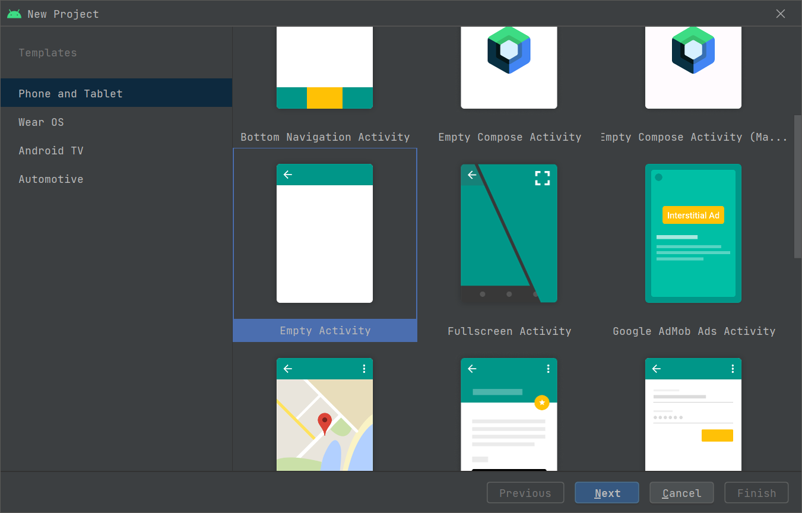

# Android Studio类微信界面制作
<font color="red"><em>本文将简要介绍类微信界面的制作，最后源码的下载链接将会文末给出</em></font>

### 效果图展示


### 工具准备
<li>Android Studio</li>
<li>相对应的图标</li>

## 制作流程
1. 创建 empty Activity

<font color="yellow">编程语言选择java</font><br/>
初始界面:<br/>


2. 消除上图的wechat标题栏
目标代码在 MainActivity中
```java
    protected void onCreate(Bundle savedInstanceState) {
        super.onCreate(savedInstanceState);
        /*requestWindowFeature(Window.FEATURE_NO_TITLE);*/
        if (getSupportActionBar() != null){
            getSupportActionBar().hide();
        }
        setContentView(R.layout.activity_main);
    }
```

3. 在MainActivity同级目录中创建 Fragment

选择new->Fragment->Gallery


简单介绍:</br>
Fragment layout name:
在res->layout  生成对应的xml

最终生成的java文件如下图:


解释关键Fragment 生成代码含义
```java
    public View onCreateView(LayoutInflater inflater, ViewGroup container,
                             Bundle savedInstanceState) {
        // Inflate the layout for this fragment
        return inflater.inflate(R.layout.tab02, container, false);
    }
```
```java
inflater.inflate(R.layout.tab02, container, false);
```
tab02 是相关联的 layout目录下 xml文件，false表示显示的形式

4. 制作顶栏</br>
   简单演示如何创建xml文件</br>

top.xml

```xml
   <?xml version="1.0" encoding="utf-8"?>
<LinearLayout xmlns:android="http://schemas.android.com/apk/res/android"
    android:layout_width="match_parent"
    android:layout_height="65dp"
    android:gravity="center"
    android:background="#000000"
    android:orientation="vertical">

    <TextView
        android:id="@+id/textView"
        android:layout_width="wrap_content"
        android:layout_height="wrap_content"
        android:layout_gravity="center_horizontal"
        android:layout_weight="1"
        android:text="WeChat"
        android:textColor="#ffffff"
        android:textSize="40sp" />
</LinearLayout>
```
实现效果


<font color="red">注意，已经将相关文件放入drawable中</font>


5. 制作bottom
相关代码
```xml
<?xml version="1.0" encoding="utf-8"?>
<LinearLayout xmlns:android="http://schemas.android.com/apk/res/android"
    xmlns:app="http://schemas.android.com/apk/res-auto"
    android:layout_width="match_parent"
    android:background="@drawable/bottom_bar"
    android:layout_height="130dp"
    android:baselineAligned="false">

    <LinearLayout
        android:id="@+id/id_tab_weixin"
        android:layout_width="0dp"
        android:layout_height="match_parent"
        android:layout_weight="1"
        android:orientation="vertical">

        <ImageButton
            android:id="@+id/id_tab_WeChat_img"
            android:layout_width="110dp"
            android:layout_height="80dp"
            android:background="#000000"
            android:contentDescription="@string/app_name"
            android:clickable="false"
            android:scaleType="fitCenter"
            app:srcCompat="@drawable/tab_weixin_pressed" />

        <TextView
            android:id="@+id/textView2"
            android:layout_width="match_parent"
            android:layout_height="wrap_content"
            android:layout_weight="1"
            android:gravity="center_horizontal"
            android:clickable="false"
            android:saveEnabled="false"
            android:text="微信"
            android:textColor="#ffffff"
            android:textSize="15sp" />

    </LinearLayout>

    <LinearLayout
        android:id="@+id/id_tab_frd"
        android:layout_width="0dp"
        android:layout_height="match_parent"
        android:layout_weight="1"
        android:orientation="vertical">

        <ImageButton
            android:clickable="false"
            android:id="@+id/id_tab_frd_img"
            android:layout_width="110dp"
            android:layout_height="80dp"
            android:background="#000000"
            android:contentDescription="@string/app_name"
            android:scaleType="fitCenter"
            app:srcCompat="@drawable/tab_find_frd_normal" />

        <TextView
            android:clickable="false"
            android:id="@+id/textView3"
            android:layout_width="match_parent"
            android:layout_height="wrap_content"
            android:layout_weight="1"
            android:gravity="center_horizontal"
            android:saveEnabled="false"
            android:text="朋友"
            android:textColor="#ffffff"
            android:textSize="15sp" />

    </LinearLayout>

    <LinearLayout
        android:id="@+id/id_tab_contact"
        android:layout_width="0dp"
        android:layout_height="match_parent"
        android:layout_weight="1"
        android:orientation="vertical">

        <ImageButton
            android:clickable="false"
            android:id="@+id/id_tab_contact_img"
            android:layout_width="110dp"
            android:layout_height="80dp"
            android:background="#000000"
            android:contentDescription="@string/app_name"
            android:scaleType="fitCenter"
            app:srcCompat="@drawable/tab_address_normal" />

        <TextView
            android:clickable="false"
            android:id="@+id/textView4"
            android:layout_width="match_parent"
            android:layout_height="wrap_content"
            android:layout_weight="1"
            android:gravity="center_horizontal"
            android:saveEnabled="false"
            android:text="通讯录"
            android:textColor="#ffffff"
            android:textSize="15sp" />

    </LinearLayout>

    <LinearLayout
        android:id="@+id/id_tab_settings"
        android:layout_width="0dp"
        android:layout_height="match_parent"
        android:layout_weight="1"
        android:orientation="vertical">

        <ImageButton
            android:clickable="false"
            android:id="@+id/id_tab_settings_img"
            android:layout_width="110dp"
            android:layout_height="80dp"
            android:background="#000000"
            android:contentDescription="@string/app_name"
            android:scaleType="fitCenter"
            app:srcCompat="@drawable/tab_settings_normal" />

        <TextView
            android:clickable="false"
            android:id="@+id/textView5"
            android:layout_width="match_parent"
            android:layout_height="wrap_content"
            android:layout_weight="1"
            android:gravity="center_horizontal"
            android:saveEnabled="false"
            android:text="设置"
            android:textColor="#ffffff"
            android:textSize="15sp" />

    </LinearLayout>

</LinearLayout>
```

效果图


6. MainActivity文件


<font color="yellow">oncreate函数 调用后续函数</font>
```java
    protected void onCreate(Bundle savedInstanceState) {
        super.onCreate(savedInstanceState);
        if (getSupportActionBar() != null){
            getSupportActionBar().hide();
        }
        setContentView(R.layout.activity_main);

        initFragment();
        initView();
        initEvent();
        selectFragment(0);
    }
```
<font color="yellow">initFragment函数 事务绑定 添加界面</font>
```java
    private void initFragment() {
        fm = getSupportFragmentManager();
        FragmentTransaction transaction = fm.beginTransaction();
        transaction.add(R.id.id_content, mTab01);
        transaction.add(R.id.id_content, mTab02);
        transaction.add(R.id.id_content, mTab03);
        transaction.add(R.id.id_content, mTab04);
        transaction.commit();
    }
```
<font color="yellow">resetImags函数提供灰暗图片</font>
```java
    private void resetImgs() {
        mImgWeChat.setImageResource(R.drawable.tab_weixin_normal);
        mImgFrd.setImageResource(R.drawable.tab_find_frd_normal);
        mImgFind.setImageResource(R.drawable.tab_address_normal);
        mImgSettings.setImageResource(R.drawable.tab_settings_normal);

    }
```
<font color="yellow">initView函数 将图片与变量绑定</font>
```java
    private void initView() {
        mTabWeChat = (LinearLayout) findViewById(R.id.id_tab_weixin);
        mTabFrd = (LinearLayout) findViewById(R.id.id_tab_frd);
        mTabFind = (LinearLayout) findViewById(R.id.id_tab_contact);
        mTabSettings = (LinearLayout) findViewById(R.id.id_tab_settings);

        mImgWeChat = (ImageButton) findViewById(R.id.id_tab_WeChat_img);
        mImgFrd = (ImageButton) findViewById(R.id.id_tab_frd_img);
        mImgFind = (ImageButton) findViewById(R.id.id_tab_contact_img);
        mImgSettings = (ImageButton) findViewById(R.id.id_tab_settings_img);

    }
```

<font color="yellow">selectFragment函数 点击切换图标效果</font>
```java
    private void selectFragment(int i) {
        FragmentTransaction transaction = fm.beginTransaction();
        hideFragment(transaction);
        //把图片设置为亮的
        //设置内容区域
        switch (i) {
            case 0:
                Log.d("setSelect", "1");
                transaction.show(mTab01);
                mImgWeChat.setImageResource(R.drawable.tab_weixin_pressed);
                break;
            case 1:
                transaction.show(mTab02);
                mImgFrd.setImageResource(R.drawable.tab_find_frd_pressed);
                break;
            case 2:
                transaction.show(mTab03);
                mImgFind.setImageResource(R.drawable.tab_address_pressed);
                break;
            case 3:
                transaction.show(mTab04);
                mImgSettings.setImageResource(R.drawable.tab_settings_pressed);
                break;
            default:
                break;
        }
        transaction.commit();
    }
```
<font color="yellow">initEvent函数 触发事件</font>
```java
    private void initEvent() {
        mTabWeChat.setOnClickListener(this);
        mTabFrd.setOnClickListener(this);
        mTabFind.setOnClickListener(this);
        mTabSettings.setOnClickListener(this);
    }
```

源代码地址:


